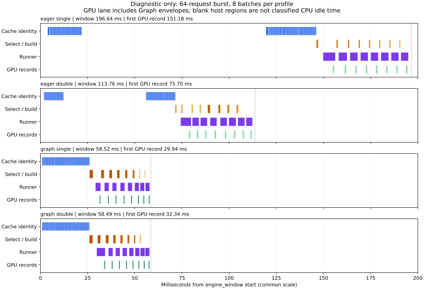

# Complete Async Engine: diagnostic evidence

Measured source: `6351d53dec23e72c27c88b4c6650f7c4a9a572f3`, RTX 5090, PyTorch
2.8.0+cu128, CUDA 12.8, driver 595.84, Nsight Systems 2024.6.2.225. The profiling
entry point uses one PyTorch intra-op thread, unlike the formal scheduler runs'
56 threads. Do not compare their absolute throughput as one experiment.

Four single-process diagnostic captures use the same real checkpoint and identical
64-request input SHA256 `ca895b5b600c2802858363ad89abacd19925d506f238942800bb02d62d3c93e3`.
All use Cache-Aware, a hotspot burst, all-hit geometry/wavelet caches, and eight
batches of eight. All 64 requests and eight correctness probes per capture pass;
there are no errors, dropped trace events or open request spans.

These are single captures with instrumentation, not a repeated performance A/B.
The [publication manifest](publication.json) describes path and process/thread ID
anonymization. Raw binary reports and machine-specific environment dumps are not
published. JSON phase durations and input samples are preserved; GPU evidence is
exported into relative intervals without process IDs or device UUIDs.

## Timing boundaries and evidence

| Capture | JSON window ms | First scheduler selection ms | First GPU record ms | Mean queue ms | Mean request execution ms | Mean decoder-tail host span ms |
|:---|---:|---:|---:|---:|---:|---:|
| eager_single | 196.634 | 146.343 | 151.180 | 86.549 | 5.163 | 2.028 |
| eager_double | 113.752 | 71.565 | 75.704 | 50.297 | 4.874 | 1.697 |
| graph_single | 58.519 | 26.087 | 29.939 | 29.557 | 2.706 | 0.283 |
| graph_double | 58.486 | 25.988 | 32.340 | 29.628 | 3.636 | 0.276 |

Offsets are relative to `engine_window`; GPU offsets use the corresponding NVTX
window. Python JSON and NVTX range boundaries differ by a few microseconds.
Request execution includes executor dispatch and delivery, while runner spans
cover worker execution. Neither is pure GPU compute time. Queue/request ranges
overlap across requests and must not be added to host phase totals.



The plot aligns each capture to its own window and uses a common time scale.
Uncolored host time is simply outside the selected instrumentation; it does not
establish whether the CPU was idle, descheduled or executing uninstrumented code.

## What the traces establish

1. **Admission and host scheduling remain important.** All 64 cache-identity spans
   finish before the first scheduler selection. Identity construction alone totals
   19.39–33.49 ms. In Graph captures it totals about 19.5 ms of a 58.5 ms window;
   scheduler selection adds about 7.8–8.0 ms in separate ranges. These are concrete
   host costs to investigate before optimizing another GPU kernel.

2. **The eager window difference is not a measured double-buffer speedup.** The
   two eager windows differ by 82.88 ms, but 74.78 ms of that difference occurs
   before the first scheduler selection, when no batch has been prefetched or
   executed. After first selection, remaining time is 50.29 versus 42.19 ms.
   A single capture cannot isolate buffering from startup/admission variability.

3. **Graph replay reduces recorded host submissions.** Within the measured window,
   eager captures contain 317 `cudaLaunchKernel` and 40 `cuLaunchKernel` API calls;
   Graph captures contain 56 direct launch calls and eight `cudaGraphLaunch` calls.
   Graph-internal kernels are folded into graph-level trace envelopes, not removed.
   The eight replay calls are the measured count; diagnostic runner counters also
   include pre-window warmup/capture invocations and must not be used for that count.

4. **The evidence does not show a GPU-bound Graph engine.** Unioned recorded GPU
   intervals cover 3.55–3.56 ms, about 6.07–6.08% of the Graph windows, including
   eight Graph envelopes. Internal Graph gaps make this an envelope coverage
   measure, not GPU Active, SM utilization or occupancy. The long pre-GPU period
   and remaining host gaps contradict a claim that device compute dominates the
   complete captured window.

5. **The dynamic schedule also changes.** Despite identical input SHA and batch
   sizes, starvation-guard dispatches are 39/26 in eager single/double versus 2/1
   with Graph. Geometry dedup counts are 44 versus 45; scheduler cache probes are
   57/198 versus 462/487. Deadline/age decisions depend on elapsed wall time, so
   matching request inputs does not guarantee identical internal batch membership.

The next controlled experiment should warm the Engine admission/executor path,
fix CPU thread settings, repeat each configuration and record actual batch request
membership. Investigate identity construction, event-loop admission and scheduler
ranking. Lock contention and Python stack attribution need additional tracing;
the current capture disables CPU sampling and does not time lock waits separately.
There is no evidence here for changing output ownership or relaxing synchronization.

## Inspect and reproduce

Each of [eager_single](eager_single/), [eager_double](eager_double/),
[graph_single](graph_single/) and [graph_double](graph_double/) includes:

- `diagnostic.json`, `requests.json`, `trace.json`, `report.md`;
- `gpu_timeline.json`: clipped kernel/copy/memset/Graph intervals, CUDA API totals,
  NVTX window duration and source SQLite SHA256.

Open `trace.json` in a Chrome trace-compatible viewer. GPU intervals are extracted
by [analyze_engine_sqlite.py](../../../analyze_engine_sqlite.py), which clips to one
complete Engine window and merges overlapping intervals before computing coverage.

```bash
python benchmarks/analyze_engine_sqlite.py /path/to/engine.sqlite \
  --output /tmp/rebuilt_gpu_timeline.json
python benchmarks/plot_performance_results.py \
  --profile-dir benchmarks/results/engine_profile/20260922_rtx5090_6351d53
```

The plot uses optional `matplotlib==3.10.8`. Collection commands and precise span
semantics are in [ENGINE_PROFILING.md](../../../../docs/ENGINE_PROFILING.md).
