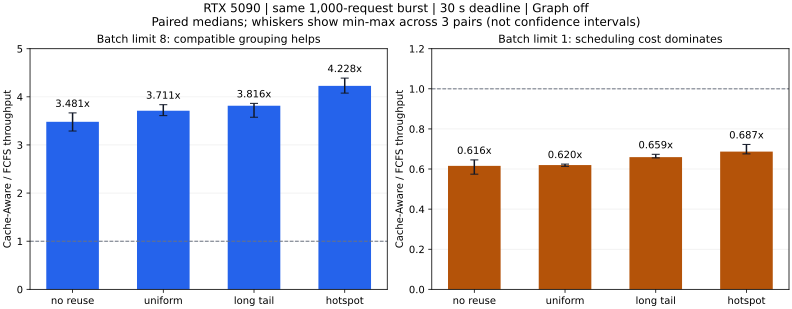

# RTX 5090 scheduler comparison

Source: `6351d53dec23e72c27c88b4c6650f7c4a9a572f3`. Two complete 24-run matrices,
48,000 completed requests, zero timeouts/failures/cancellations, and all 384 sampled
uncached-reference comparisons passed. The largest observed relative L2 error was
`2.84e-7`; maximum absolute error was `4.77e-7`. [All 82 server tests passed](tests.log),
including the four CUDA integration tests.

These are reviewed, sanitized copies. See [publication.json](publication.json) for
metadata transformations and original/published JSON hashes. Timing samples,
metrics, model/config/trace hashes and run status are unchanged. Summaries were
regenerated against the published copies. Paths and the GPU UUID are anonymized;
`GPU-ANON-0` consistently identifies the same device across both matrices.

## Protocol and environment

- NVIDIA GeForce RTX 5090, CUDA logical device 0, driver 595.84; no other compute
  process was observed by the benchmark's device check (not continuous monitoring).
- Python 3.9.25, PyTorch 2.8.0+cu128, CUDA 12.8, float32, Graph off, profiler off.
- Xeon Gold 6330; PyTorch intra-op/inter-op threads: 56/56, identical across runs.
- Same checkpoint and normalization as identified by SHA256 in each result.
- 1,000 fixed burst requests, four warm mediums, cold geometry/wavelet caches,
  30-second per-request timeout. Three independent processes per policy/scenario.
- Main matrix: batch limit 8. Control: batch limit 1, all other configuration and
  request traces unchanged. Counterbalanced adjacent FCFS/Cache-Aware pairs.

The 30-second completion protocol is separate from the historical 5-second SLO.
It does not demonstrate compliance with that earlier deadline.

## Paired results

Ratios and reductions below are medians of three per-repeat comparisons. They are
not ratios of independently summarized latency/throughput medians.

| Scenario | Batch ≤ 8 throughput ratio | E2E p99 reduction | Batch = 1 throughput ratio | E2E p99 increase |
|:---|---:|---:|---:|---:|
| no_reuse | 3.481x | 75.85% | 0.616x | 64.16% |
| uniform_reuse | 3.711x | 76.39% | 0.620x | 64.42% |
| long_tail_reuse | 3.816x | 77.23% | 0.659x | 53.99% |
| hotspot_reuse | 4.228x | 80.05% | 0.687x | 47.65% |



The main matrix's mean batch is 1.00 for strict FCFS and 7.8125 for Cache-Aware
(128 batches), corresponding to 12.5% versus 97.66% fill at a limit of 8. The
interleaved-medium trace prevents strict FCFS from grouping adjacent requests;
Cache-Aware selects compatible requests further in the queue. Even `no_reuse`
improves, supporting batching as a major source of benefit. This is not evidence
for a universal cache-hit improvement or an exact causal decomposition.

At batch limit 1 the observed cache-hit rates are identical between policies, but
Cache-Aware is slower: scheduler selection costs about 2,531–2,579 us/request,
versus 183–192 us/request for FCFS (group medians). Profiling the ranking/probing
path is a better next step for this regime than claiming a cache benefit.

Main-matrix selection costs are 256–292 us/request for Cache-Aware and
182–198 us/request for FCFS. Paired peak allocated memory increases by
192.26–195.78 MiB. Both the CPU cost and memory cost accompany the throughput gain.

## Cache and fairness interpretation

Geometry cache lookup hit rates can be **lower** for Cache-Aware: the hotspot
median is 80.32%, versus FCFS's 93.90%. The runtime deduplicates requests within a
batch before performing cache lookups, changing the denominator. Batch sharing,
runtime deduplication and lookup hit rates are different metrics; do not combine
them into a single cache-hit claim.

Every run dispatches all 1,000 requests after the 50 ms starvation threshold.
The largest dispatch age across the two matrices is 14,632.51 ms. Thus this burst
primarily tests the starvation-guard path with compatible grouping; it does not
demonstrate low-load locality ranking or a 50 ms maximum queue wait. All requests
do complete within the configured 30-second budget.

Full queue/execution/E2E p50/p95/p99, cache/sharing, scheduler, fairness and memory
tables: [main metrics](main/metrics.md), [batch=1 metrics](batch1/metrics.md).
Independent-run medians/min/max/CV and paired comparisons:
[main summary](main/summary.md), [batch=1 summary](batch1/summary.md).
Each directory includes all 24 result JSON files, logs and execution-order session.

## Reproduction

Use the measured commit and [benchmark instructions](../../../../docs/BENCHMARK_REPRODUCTION.md).
To rebuild summaries from these public JSON files:

```bash
python benchmarks/summarize_scheduler_ab.py \
  --input-dir benchmarks/results/scheduler_ab/20260922_rtx5090_6351d53/main
python benchmarks/summarize_scheduler_ab.py \
  --config benchmarks/configs/scheduler_batch1_ab.json \
  --input-dir benchmarks/results/scheduler_ab/20260922_rtx5090_6351d53/batch1
# Optional plotting dependency, separate from runtime requirements:
python -m pip install matplotlib==3.10.8
python benchmarks/plot_performance_results.py \
  --scheduler-dir benchmarks/results/scheduler_ab/20260922_rtx5090_6351d53
```
