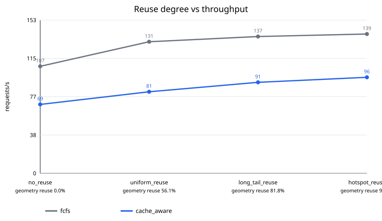

# FCFS vs Cache-Aware scheduler formal summary

Status: `passed`

- Commit: `6351d53dec23e72c27c88b4c6650f7c4a9a572f3`
- GPU: `NVIDIA GeForce RTX 5090` (`GPU-ANON-0`)
- PyTorch/CUDA: `2.8.0+cu128` / `12.8`
- Runs: 24 passed / 24 expected

Percentiles below are medians of independent run-level metrics; raw samples are not pooled.

## Run-level metrics

| Scenario | Policy | Runs | req/s | Queue p99 ms | E2E p99 ms | Mean batch | Fill | Geometry shared | Wavelet shared | Scheduler us/req |
|:---|:---:|---:|---:|---:|---:|---:|---:|---:|---:|---:|
| no_reuse | fcfs | 3 | 106.87 | 8872.707 | 8880.262 | 1.00 | 100.0% | 0.0% | 0.0% | 186.60 |
| no_reuse | cache_aware | 3 | 68.76 | 14132.292 | 14140.059 | 1.00 | 100.0% | 0.0% | 0.0% | 2578.56 |
| uniform_reuse | fcfs | 3 | 131.39 | 7242.073 | 7245.770 | 1.00 | 100.0% | 0.0% | 0.0% | 191.46 |
| uniform_reuse | cache_aware | 3 | 81.43 | 11908.894 | 11913.166 | 1.00 | 100.0% | 0.0% | 0.0% | 2551.17 |
| long_tail_reuse | fcfs | 3 | 136.58 | 6957.219 | 6960.999 | 1.00 | 100.0% | 0.0% | 0.0% | 184.01 |
| long_tail_reuse | cache_aware | 3 | 90.87 | 10637.083 | 10641.325 | 1.00 | 100.0% | 0.0% | 0.0% | 2531.53 |
| hotspot_reuse | fcfs | 3 | 139.10 | 6822.076 | 6825.880 | 1.00 | 100.0% | 0.0% | 0.0% | 182.70 |
| hotspot_reuse | cache_aware | 3 | 95.89 | 10058.708 | 10063.191 | 1.00 | 100.0% | 0.0% | 0.0% | 2570.34 |

## Paired Cache-Aware vs FCFS comparison

| Scenario | Pairs | Throughput speedup | E2E p99 reduction | Queue p99 reduction | Fill delta | Geometry hit delta | Peak delta MiB |
|:---|---:|---:|---:|---:|---:|---:|---:|
| no_reuse | 3 | 0.616x | -64.16% | -64.21% | 0.000 | 0.000 | 0.00 |
| uniform_reuse | 3 | 0.620x | -64.42% | -64.44% | 0.000 | 0.000 | 0.00 |
| long_tail_reuse | 3 | 0.659x | -53.99% | -54.00% | 0.000 | 0.000 | 0.00 |
| hotspot_reuse | 3 | 0.687x | -47.65% | -47.67% | 0.000 | 0.000 | 0.00 |

## Completion and correctness

| Run | Status | Succeeded | Timed out | Failed | Mean batch | Probes passed |
|:---|:---|---:|---:|---:|---:|:---|
| scheduler_cache_aware_hotspot_reuse_run1 | passed | 1000 | 0 | 0 | 1.00 | True |
| scheduler_cache_aware_hotspot_reuse_run2 | passed | 1000 | 0 | 0 | 1.00 | True |
| scheduler_cache_aware_hotspot_reuse_run3 | passed | 1000 | 0 | 0 | 1.00 | True |
| scheduler_cache_aware_long_tail_reuse_run1 | passed | 1000 | 0 | 0 | 1.00 | True |
| scheduler_cache_aware_long_tail_reuse_run2 | passed | 1000 | 0 | 0 | 1.00 | True |
| scheduler_cache_aware_long_tail_reuse_run3 | passed | 1000 | 0 | 0 | 1.00 | True |
| scheduler_cache_aware_no_reuse_run1 | passed | 1000 | 0 | 0 | 1.00 | True |
| scheduler_cache_aware_no_reuse_run2 | passed | 1000 | 0 | 0 | 1.00 | True |
| scheduler_cache_aware_no_reuse_run3 | passed | 1000 | 0 | 0 | 1.00 | True |
| scheduler_cache_aware_uniform_reuse_run1 | passed | 1000 | 0 | 0 | 1.00 | True |
| scheduler_cache_aware_uniform_reuse_run2 | passed | 1000 | 0 | 0 | 1.00 | True |
| scheduler_cache_aware_uniform_reuse_run3 | passed | 1000 | 0 | 0 | 1.00 | True |
| scheduler_fcfs_hotspot_reuse_run1 | passed | 1000 | 0 | 0 | 1.00 | True |
| scheduler_fcfs_hotspot_reuse_run2 | passed | 1000 | 0 | 0 | 1.00 | True |
| scheduler_fcfs_hotspot_reuse_run3 | passed | 1000 | 0 | 0 | 1.00 | True |
| scheduler_fcfs_long_tail_reuse_run1 | passed | 1000 | 0 | 0 | 1.00 | True |
| scheduler_fcfs_long_tail_reuse_run2 | passed | 1000 | 0 | 0 | 1.00 | True |
| scheduler_fcfs_long_tail_reuse_run3 | passed | 1000 | 0 | 0 | 1.00 | True |
| scheduler_fcfs_no_reuse_run1 | passed | 1000 | 0 | 0 | 1.00 | True |
| scheduler_fcfs_no_reuse_run2 | passed | 1000 | 0 | 0 | 1.00 | True |
| scheduler_fcfs_no_reuse_run3 | passed | 1000 | 0 | 0 | 1.00 | True |
| scheduler_fcfs_uniform_reuse_run1 | passed | 1000 | 0 | 0 | 1.00 | True |
| scheduler_fcfs_uniform_reuse_run2 | passed | 1000 | 0 | 0 | 1.00 | True |
| scheduler_fcfs_uniform_reuse_run3 | passed | 1000 | 0 | 0 | 1.00 | True |

## Notes

- All percentiles are summarized from run-level metrics; raw samples are not pooled.
- Each FCFS/cache-aware pair reads the same checked-in request trace.
- Throughput speedup is cache-aware / FCFS.
- Latency reduction is (FCFS - cache-aware) / FCFS * 100%.
- CUDA Graph is disabled for every run so the comparison isolates scheduling.
- The interleaved-medium trace forces strict FCFS into singleton batches; a speedup alone cannot be attributed to cache hits.
