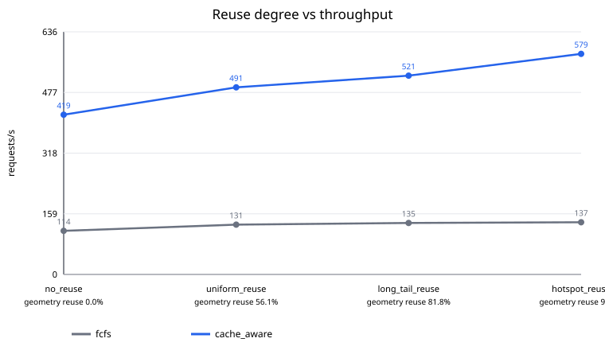

# FCFS vs Cache-Aware scheduler formal summary

Status: `passed`

- Commit: `6351d53dec23e72c27c88b4c6650f7c4a9a572f3`
- GPU: `NVIDIA GeForce RTX 5090` (`GPU-ANON-0`)
- PyTorch/CUDA: `2.8.0+cu128` / `12.8`
- Runs: 24 passed / 24 expected

Percentiles below are medians of independent run-level metrics; raw samples are not pooled.

## Run-level metrics

| Scenario | Policy | Runs | req/s | Queue p99 ms | E2E p99 ms | Mean batch | Fill | Geometry shared | Wavelet shared | Scheduler us/req |
|:---|:---:|---:|---:|---:|---:|---:|---:|---:|---:|---:|
| no_reuse | fcfs | 3 | 114.32 | 8368.375 | 8373.513 | 1.00 | 12.5% | 0.0% | 0.0% | 182.41 |
| no_reuse | cache_aware | 3 | 419.10 | 1990.316 | 2002.266 | 7.81 | 97.7% | 0.0% | 0.0% | 292.21 |
| uniform_reuse | fcfs | 3 | 130.68 | 7270.729 | 7274.373 | 1.00 | 12.5% | 0.0% | 0.0% | 198.34 |
| uniform_reuse | cache_aware | 3 | 490.79 | 1691.613 | 1699.795 | 7.81 | 97.7% | 5.6% | 7.7% | 284.38 |
| long_tail_reuse | fcfs | 3 | 134.92 | 7027.203 | 7031.012 | 1.00 | 12.5% | 0.0% | 0.0% | 183.08 |
| long_tail_reuse | cache_aware | 3 | 521.38 | 1572.760 | 1578.425 | 7.81 | 97.7% | 48.3% | 53.7% | 271.34 |
| hotspot_reuse | fcfs | 3 | 136.86 | 6939.599 | 6943.180 | 1.00 | 12.5% | 0.0% | 0.0% | 195.82 |
| hotspot_reuse | cache_aware | 3 | 578.60 | 1377.340 | 1384.989 | 7.81 | 97.7% | 82.5% | 82.3% | 255.73 |

## Paired Cache-Aware vs FCFS comparison

| Scenario | Pairs | Throughput speedup | E2E p99 reduction | Queue p99 reduction | Fill delta | Geometry hit delta | Peak delta MiB |
|:---|---:|---:|---:|---:|---:|---:|---:|
| no_reuse | 3 | 3.481x | 75.85% | 75.98% | 0.852 | 0.000 | 192.26 |
| uniform_reuse | 3 | 3.711x | 76.39% | 76.49% | 0.852 | -0.013 | 195.78 |
| long_tail_reuse | 3 | 3.816x | 77.23% | 77.29% | 0.852 | -0.077 | 195.21 |
| hotspot_reuse | 3 | 4.228x | 80.05% | 80.15% | 0.852 | -0.136 | 195.31 |

## Completion and correctness

| Run | Status | Succeeded | Timed out | Failed | Mean batch | Probes passed |
|:---|:---|---:|---:|---:|---:|:---|
| scheduler_cache_aware_hotspot_reuse_run1 | passed | 1000 | 0 | 0 | 7.81 | True |
| scheduler_cache_aware_hotspot_reuse_run2 | passed | 1000 | 0 | 0 | 7.81 | True |
| scheduler_cache_aware_hotspot_reuse_run3 | passed | 1000 | 0 | 0 | 7.81 | True |
| scheduler_cache_aware_long_tail_reuse_run1 | passed | 1000 | 0 | 0 | 7.81 | True |
| scheduler_cache_aware_long_tail_reuse_run2 | passed | 1000 | 0 | 0 | 7.81 | True |
| scheduler_cache_aware_long_tail_reuse_run3 | passed | 1000 | 0 | 0 | 7.81 | True |
| scheduler_cache_aware_no_reuse_run1 | passed | 1000 | 0 | 0 | 7.81 | True |
| scheduler_cache_aware_no_reuse_run2 | passed | 1000 | 0 | 0 | 7.81 | True |
| scheduler_cache_aware_no_reuse_run3 | passed | 1000 | 0 | 0 | 7.81 | True |
| scheduler_cache_aware_uniform_reuse_run1 | passed | 1000 | 0 | 0 | 7.81 | True |
| scheduler_cache_aware_uniform_reuse_run2 | passed | 1000 | 0 | 0 | 7.81 | True |
| scheduler_cache_aware_uniform_reuse_run3 | passed | 1000 | 0 | 0 | 7.81 | True |
| scheduler_fcfs_hotspot_reuse_run1 | passed | 1000 | 0 | 0 | 1.00 | True |
| scheduler_fcfs_hotspot_reuse_run2 | passed | 1000 | 0 | 0 | 1.00 | True |
| scheduler_fcfs_hotspot_reuse_run3 | passed | 1000 | 0 | 0 | 1.00 | True |
| scheduler_fcfs_long_tail_reuse_run1 | passed | 1000 | 0 | 0 | 1.00 | True |
| scheduler_fcfs_long_tail_reuse_run2 | passed | 1000 | 0 | 0 | 1.00 | True |
| scheduler_fcfs_long_tail_reuse_run3 | passed | 1000 | 0 | 0 | 1.00 | True |
| scheduler_fcfs_no_reuse_run1 | passed | 1000 | 0 | 0 | 1.00 | True |
| scheduler_fcfs_no_reuse_run2 | passed | 1000 | 0 | 0 | 1.00 | True |
| scheduler_fcfs_no_reuse_run3 | passed | 1000 | 0 | 0 | 1.00 | True |
| scheduler_fcfs_uniform_reuse_run1 | passed | 1000 | 0 | 0 | 1.00 | True |
| scheduler_fcfs_uniform_reuse_run2 | passed | 1000 | 0 | 0 | 1.00 | True |
| scheduler_fcfs_uniform_reuse_run3 | passed | 1000 | 0 | 0 | 1.00 | True |

## Notes

- All percentiles are summarized from run-level metrics; raw samples are not pooled.
- Each FCFS/cache-aware pair reads the same checked-in request trace.
- Throughput speedup is cache-aware / FCFS.
- Latency reduction is (FCFS - cache-aware) / FCFS * 100%.
- CUDA Graph is disabled for every run so the comparison isolates scheduling.
- The interleaved-medium trace forces strict FCFS into singleton batches; a speedup alone cannot be attributed to cache hits.
