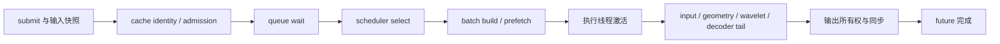

# 完整 Async Engine 的诊断方法

`benchmarks/profile_engine.py` 运行小规模确定性请求，输出 `diagnostic.json`、实际输入
`requests.json` 和可用 Perfetto/Chrome trace viewer 打开的 `trace.json`。默认使用真实
checkpoint；`--toy` 是固定种子小模型，仅验证执行路径。所有结果标为 diagnostic。

## 请求生命周期



| 范围 | 含义 |
|---|---|
| `feno.request_e2e` | JSON 中从 submit 开始到 future 设置结果/错误；包含输入身份构造 |
| `feno.queue_wait` | enqueue 到 execution activation；包含已预取但尚未执行的等待 |
| `feno.cache_identity` | 请求的规范化、摘要和兼容性 key 构造 |
| `feno.scheduler_select` | 一次选择；嵌套 `feno.cache_lookup` 是无副作用的 residency probe |
| `feno.batch_build` | CPU stack、receiver 补齐与 batch 构造 |
| `feno.runner_execute` | 执行线程中的 runner、输出处理以及配置要求的同步 |
| `feno.output_ownership` | Engine 的输出 clone、拆分和可选 lease 传递 |
| runner 五阶段 | input_prepare、geometry_resolve、wavelet_resolve、decoder_tail、output |
| `feno.device_synchronize` | 等待设备/执行 stream 完成，属于 service 耗时 |
| `feno.completion` | event loop 上的错误/deadline 判断和 future 交付 |

JSON 的 request 范围使用请求对象中真实时间戳。NVTX 的 request/queue range 在 admission
完成时打开，因此 NVTX request_e2e 不包含先前的输入验证；完整 submit 延迟以 JSON/engine
指标为准。跨 coroutine 的 NVTX 使用 start/end handle，不跨 await 维护线程 push/pop 栈。
线程阶段与请求阶段存在嵌套和重叠，不可把各行累计时间相加视为端到端时间。

## 使用

```bash
python benchmarks/profile_engine.py --toy --device cpu --requests 16 \
  --output-dir /tmp/feno-engine-cpu
python benchmarks/summarize_engine_profile.py /tmp/feno-engine-cpu

# 真实 checkpoint；先按 BENCHMARK_REPRODUCTION.md 设置模型环境变量
bash scripts/profile_engine_nsys.sh /tmp/feno-engine-nsys \
  --policy cache_aware --scenario hotspot_reuse --requests 64 --all-hit
```

`--single-buffer` 关闭 CPU 预取，`--cuda-graphs` 启用预捕获的 1/2/4/8 bucket，
`--arrival-interval-us` 改变请求到达间隔。默认 warm medium、cold geometry/wavelet；
`--all-hit` 预填充测量请求。capture 与预热发生在 `feno.engine_window` 之前。

Nsight 可以记录整个进程；分析时只选 engine_window。配对时使用相同模型、requests.json
SHA、请求数、cache 状态和到达间隔，并分别使用新目录。Graph 与 prefetch 的对照是诊断
实验，不能取代 Graph A/B 和调度 A/B 的无 profiler 正式结果。

## 分析顺序与判断边界

1. 先确认零异常、正确性通过、零 dropped_events、零 active_requests。
2. 检查 queue 与 E2E 的逐请求时间线，区分 burst 积压和单批 service 时间。
3. 检查 scheduler、batch build 是否挡住下一批提交；对照 single/double buffer。
4. 查看 worker 中 CUDA API 与 kernel 时间线。`runner_execute` 不是 GPU Active。
5. 查看 Graph 前后 GPU 空隙、同步、输入复制和输出 clone；数值检查在窗口外。
6. 若 CPU 始终供不上 GPU，再做 CPU sampling；若重 kernel 主导，再进入 Nsight Compute。

当前代码中 engine 在 runner 返回后可能再次 clone 输出，这只是候选开销，必须由时间线
确定占比后再决定是否改变所有权协议。当前 JSON 不单独测量 lock 等待，不能由 cache lookup
范围直接推出锁争用结论。采集脚本关闭 CPU sampling；需要分析 Python 栈时另开实验。

真实模型的性能结论需要相同输入的配对 trace；toy 只验证采集和请求生命周期。
