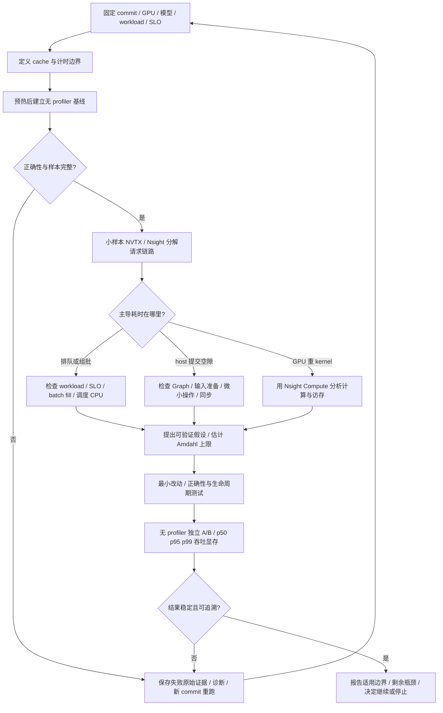

# 一页性能分析流程

三个不能互换的时间：queue 是等待；service 包含 host 提交与同步；GPU Active 是实际
GPU 操作活跃区间。Projection 是首尾跨度。分位数不相加，重叠 phase 的累计时间不相加。

正式结果必须保存原始 samples、配置/trace/model SHA、硬件软件身份、每个独立 run、
正确性和错误记录。失败运行不能静默删除，诊断耗时不能作为正式速度提升。
